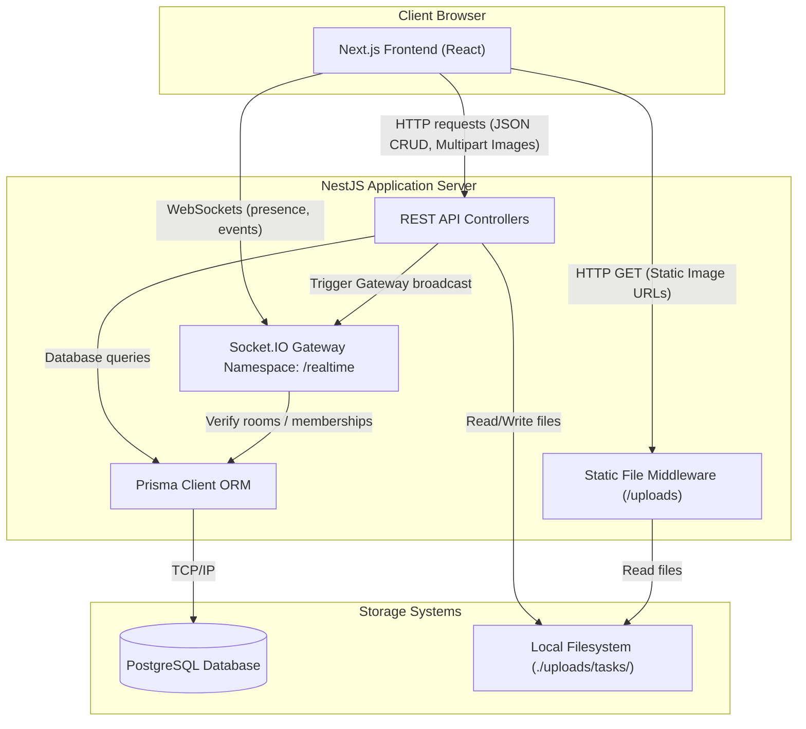
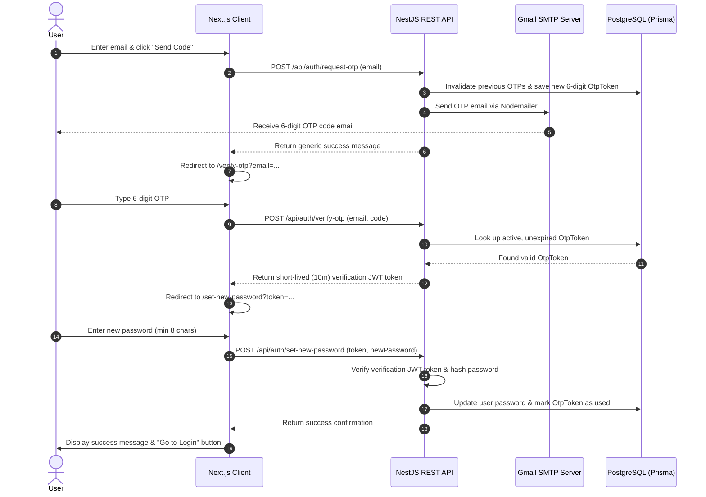

# System Architecture & Workflows

This document outlines the system architecture, component relationships, authentication flow, static files management, and real-time collaboration workflows of the Task Tracker application.

---

## System Components Diagram

The diagram below visualizes how the Next.js frontend client, the NestJS server application, PostgreSQL database, and the local disk storage interact.



---

## Authentication Flow

Authentication is stateless and uses JSON Web Tokens (JWT).

1. **Sign In / Registration**: The user registers or logs in via `/api/auth/register` or `/api/auth/login`. On success, the REST API returns a signed JWT containing user metadata in the payload and an expiration period (default: `7 days`).
2. **REST API Authorization**: The client stores the JWT in memory/local storage and appends it as a Bearer Token in the HTTP `Authorization` header (`Authorization: Bearer <token>`) for subsequent requests. Backend controllers protect routes using the global `JwtAuthGuard`.
3. **WebSocket Authentication**: When a client establishes a WebSocket connection to the `/realtime` namespace, it passes the JWT via the `auth.token` parameter. The `RealtimeGateway` validates this token using `JwtService` in its `handleConnection` handler. Connections with invalid or expired tokens are instantly disconnected.

---

## OTP-Based Password Reset Flow

For users who have forgotten their password, the application implements a secure 3-step OTP verification flow:



1. **Requesting the OTP**: The user inputs their email address on `/forgot-password`. The backend generates a secure 6-digit code, saves it to the database with a 15-minute expiration, and fires an email via Nodemailer using Gmail SMTP. The API returns a generic message to prevent email enumeration.
2. **Verifying the OTP**: The user enters the code on `/verify-otp`. The frontend features an auto-focusing 6-box input layout. If correct, the backend issues a short-lived (10-minute) verification token signed with `OTP_JWT_SECRET`.
3. **Setting the New Password**: The user inputs their new password on `/set-new-password`. The backend validates the JWT, updates the password, and marks the OTP code as used.

---

## Change Password Flow (Sidebar / Authenticated)

Logged-in users can update their password securely from the sidebar:

1. **Modal Entry**: The user clicks the "Change Password" option at the bottom of the sidebar to open the change password modal.
2. **Validation**: The user inputs their current password, a new password, and confirms the new password. The inputs use the reusable `PasswordInput` component with a toggleable eye icon.
3. **Backend Verification**: The backend validates that the new passwords match, verifies the current password hash with bcrypt, and applies the new hashed password.
4. **Session Termination**: On success, the frontend clears the authentication store (Zustand) and redirects the user to `/login` with a `message=Password changed. Please sign in with your new password.` query parameter, which is displayed as a success toast notification on the login page.

---

## Real-Time Collaboration Workflows

### 1. Task Status Change Flow

When a user changes a task status on the Kanban board:
1. The **Next.js Client** sends a `PATCH` request to `/api/projects/:projectId/tasks/:taskId` containing the new `status` value.
2. The **REST API** validates permissions and updates the database record via Prisma.
3. The **REST API** triggers the `RealtimeGateway` service method `sendToProjectRoom(projectId, 'task:updated', ...)`.
4. The gateway broadcasts the updated task model to all socket connections joined in the room: `project:<projectId>`.
5. Other active frontend clients receive the `task:updated` event, and **React Query** updates the local cache, automatically moving the task card on other users' screens.
6. The REST API logs a `STATUS_CHANGED` activity record and broadcasts `activity:new` to the project room so the feed updates instantly.

### 2. Collaborative Image Upload Flow

When a user attaches images to a task:
1. The **Next.js Client** submits a `multipart/form-data` request containing file objects in the `images` field to `/api/tasks/:taskId/images`.
2. The **REST API** interceptor checks size/MIME constraints, writes files to disk, and registers records in the `task_images` database table.
3. The **REST API** triggers `sendToProjectRoom(projectId, 'task:images_updated', ...)`.
4. The gateway broadcasts the updated images list to all clients currently viewing that project's boards.
5. Receivers' screens refresh their image attachments gallery dynamically without manual page reloads.

---

## Static File Serving Approach

- **Storage Location**: Uploaded task images are saved under `backend/uploads/tasks/` using a UUID-generated filename to prevent file-naming collisions (e.g., `550e8400-e29b-41d4-a716-446655440000.png`).
- **Serving Static Assets**: NestJS configures standard Express static middleware mapping the `/uploads` path to the filesystem directory. File requests at `http://localhost:3001/uploads/...` bypass database routing and are served directly.
- **Access Control Details**: Static file paths do not require JWT authentication for read access. This is a deliberate design decision to allow rapid browser loading of assets (via standard `` tags). Access control checks are strictly enforced during the **upload** and **delete** stages via API validation.

---

## Unified Exception Handling

The backend implements a `GlobalExceptionFilter` ensuring all errors are returned in a consistent JSON structure. If an operation fails, the client receives:

```json
{
  "statusCode": 409,
  "message": "Task has been updated by another user",
  "path": "/api/projects/proj-123/tasks/task-456",
  "timestamp": "2026-06-05T10:06:06.000Z"
}
```

This structure maps standard NestJS HttpExceptions, Prisma database errors (e.g., duplicate unique records or missing foreign keys), and JWT authentication errors.
