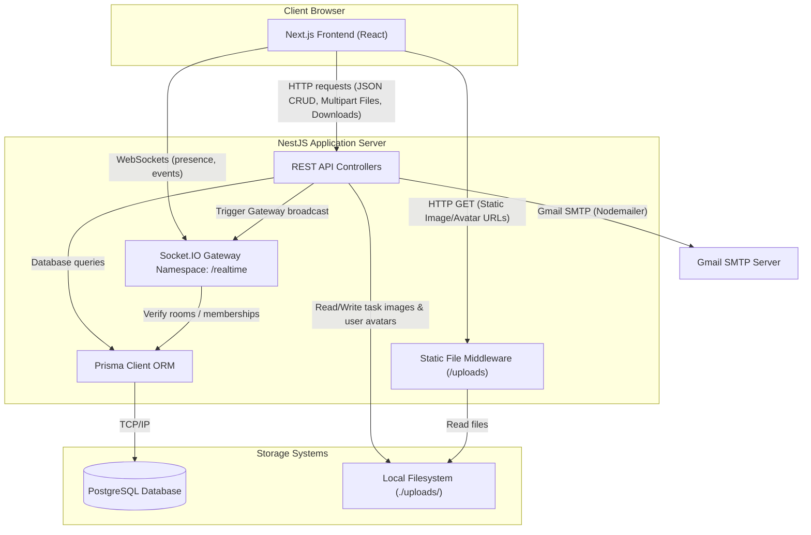
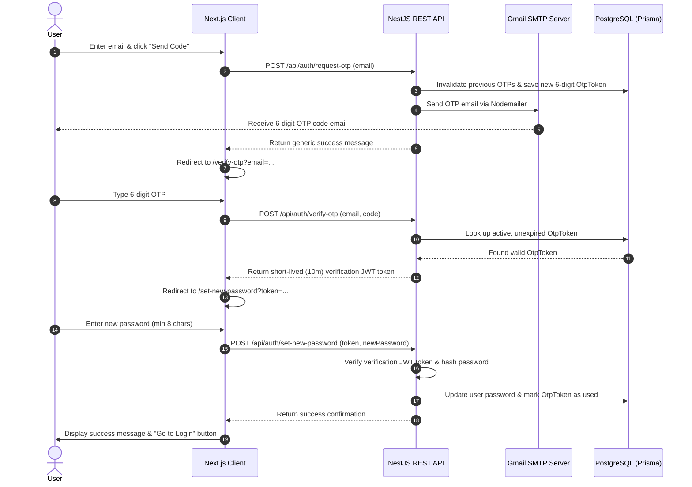

# System Architecture & Workflows

This document outlines the system architecture, component relationships, authentication flow, static files management, and real-time collaboration workflows of the Task Tracker application.

---

## System Components Diagram

The diagram below visualizes how the Next.js frontend client, the NestJS server application, PostgreSQL database, and the local disk storage interact.



---

## Authentication Flow

Authentication is stateless and uses JSON Web Tokens (JWT).

1. **Sign In / Registration**: The user registers or logs in via `/api/auth/register` or `/api/auth/login`. On success, the REST API returns a signed JWT containing user metadata in the payload and an expiration period (default: `7 days`).
2. **REST API Authorization**: The client stores the JWT in memory/local storage and appends it as a Bearer Token in the HTTP `Authorization` header (`Authorization: Bearer <token>`) for subsequent requests. Backend controllers protect routes using the global `JwtAuthGuard`.
3. **WebSocket Authentication**: When a client establishes a WebSocket connection to the `/realtime` namespace, it passes the JWT via the `auth.token` parameter. The `RealtimeGateway` validates this token using `JwtService` in its `handleConnection` handler. Connections with invalid or expired tokens are instantly disconnected.

---

## Real-Time and Asynchronous Flow Explanations

### 1. Real-Time Task Update Flow
When a user updates a task (e.g., changes its status on the Kanban board):
1. **User Action**: User moves a task card from one column to another.
2. **Client Dispatch**: The Next.js client performs an optimistic update in its local cache and issues a `PATCH` request to `/api/projects/:projectId/tasks/:taskId` containing the new `status`.
3. **Database Write**: The REST API validates permissions, checks task blockers (unresolved dependencies block status transitions to `IN_PROGRESS`), and updates the database record via Prisma.
4. **Activity Logging**: The API logs a `STATUS_CHANGED` activity record.
5. **Gateway Trigger**: The API triggers the `RealtimeGateway` to broadcast:
   - `task:updated` (with the updated task payload)
   - `activity:new` (with the new activity details)
6. **WS Broadcast**: The gateway broadcasts the events to the Socket.IO room `project:<projectId>`.
7. **Cache Synchronization**: All active clients in the room receive the events, invalidate/update their React Query caches, and the board/activity feed re-renders instantly without reloading the page.
8. **Rollback**: If the server rejects the update (e.g. task is blocked), the client receives a 400/409 error toast and the UI immediately rolls the card back to its original column.

---

### 2. Real-Time Task Image Upload Flow
When a user attaches images to a task:
1. **Selection**: User selects up to 10 images (JPEG, PNG, WebP, GIF, under 5MB per file) and uploads them.
2. **Multipart Request**: Next.js client submits a `multipart/form-data` request containing file objects to `/api/tasks/:taskId/images`.
3. **File System Write**: The REST API intercepts the payload, validates constraints, and writes the files to local disk under `uploads/tasks/` using a UUID prefix to prevent collisions.
4. **Database Registration**: The API creates `TaskImage` records pointing to the static URLs.
5. **Gateway Broadcast**: The API triggers the `RealtimeGateway` to broadcast `task:images_updated` containing the new images array to the `project:<projectId>` room.
6. **UI Render**: Active clients catch the socket broadcast, update their cache (`['task-images', projectId, taskId]`), and render the new thumbnail gallery instantly.

---

### 3. Real-Time Emoji Reaction Flow
When a user reacts to a comment with an emoji:
1. **Click Event**: User clicks an emoji reaction pill (or selects a new emoji) on a comment.
2. **Client Toggle**: Next.js client toggles the reaction locally and fires a `POST` request to `/api/comments/:commentId/reactions` with the `emoji`.
3. **Toggle Logic**: The REST API checks if the user has already reacted with this emoji. If yes, it deletes the reaction record. If no, it creates a new `CommentReaction` record.
4. **Socket Broadcast**: The API triggers the gateway to broadcast `comment:reaction_updated` containing the comment ID and the new reactions collection.
5. **Dynamic Updates**: All clients viewing the comment feed receive the broadcast, update their query cache for `['comments', taskId]`, and re-render reaction pills dynamically.

---

### 4. OTP Password Reset Flow
For users who have forgotten their password:
1. **Requesting Code**: The user submits their email on `/forgot-password`. The backend generates a secure 6-digit numeric OTP, saves it in `otp_tokens` with a 15-minute expiry, and sends an email via Nodemailer using Gmail SMTP.
2. **OTP Verification**: The user enters the 6-digit code. The client posts the code to `/api/auth/verify-otp`. The backend checks for a valid unused token. If valid, it marks the OTP as used and returns a short-lived (10-minute) verification JWT token signed with `OTP_JWT_SECRET`.
3. **Password Update**: The user inputs a new password. The client posts the password and verification JWT to `/api/auth/set-new-password`. The backend verifies the token payload, hashes the new password with bcrypt, updates the user's password, and returns a success response.



---

### 5. Export Flow
To back up or review project data:
1. **Trigger**: User navigates to Project Settings and clicks "Export to CSV" or "Export to PDF".
2. **API Request**: The browser makes an authenticated `GET` request to `/api/projects/:projectId/export/csv` or `/api/projects/:projectId/export/pdf`.
3. **Compile Snapshot**: The backend fetches the project details, all member profiles, tasks, comments, and project activities from the database via Prisma in a single transaction.
4. **Format File**:
   - **CSV**: Uses `json2csv` to compile tasks, comments, and activities into structured CSV tables.
   - **PDF**: Uses `pdfmake` to compile a multi-page document featuring a stylized cover page, tasks tabular view, details cards, comments, and audit timeline.
5. **Response Streaming**: The REST API writes response headers:
   - `Content-Type: text/csv` or `application/pdf`
   - `Content-Disposition: attachment; filename="export-project-xxxx.csv/pdf"`
   It then streams the generated bytes directly to the response socket.
6. **Download**: The browser detects the file headers and automatically triggers a local download popup.

---

## Static File Serving Approach

- **Asset Storage Directories**:
  - Task images are saved under `backend/uploads/tasks/`.
  - User profile avatars are saved under `backend/uploads/avatars/`.
- **Naming Rule**: Files are renamed with a UUID (e.g., `a75e3a89-23f2-45e0-b98a-2ea0203f0cd8.jpg`) upon save to prevent overlapping files or path injections.
- **Serving Configuration**: NestJS makes use of standard `serve-static` middleware mapping the `/uploads` context path to the physical folders. A request to `http://localhost:3001/uploads/tasks/...` or `/uploads/avatars/...` is served directly by the server engine.
- **Public Access Design**: Reading files does not require JWT authorization headers. This makes it possible to include direct URL links inside standard HTML elements (`` or `style="background-image: ..."`). Security is enforced by restricting the **write** (`POST`) and **delete** (`DELETE`) API routes using JWT authentication and project membership guards.

---

## Unified Exception Handling

The backend implements a `GlobalExceptionFilter` ensuring all errors are returned in a consistent JSON structure. If an operation fails, the client receives:

```json
{
  "statusCode": 409,
  "message": "Task has been updated by another user",
  "path": "/api/projects/proj-123/tasks/task-456",
  "timestamp": "2026-06-05T10:06:06.000Z"
}
```

This structure maps standard NestJS HttpExceptions, Prisma database errors (e.g., duplicate unique records or missing foreign keys), and JWT authentication errors.
