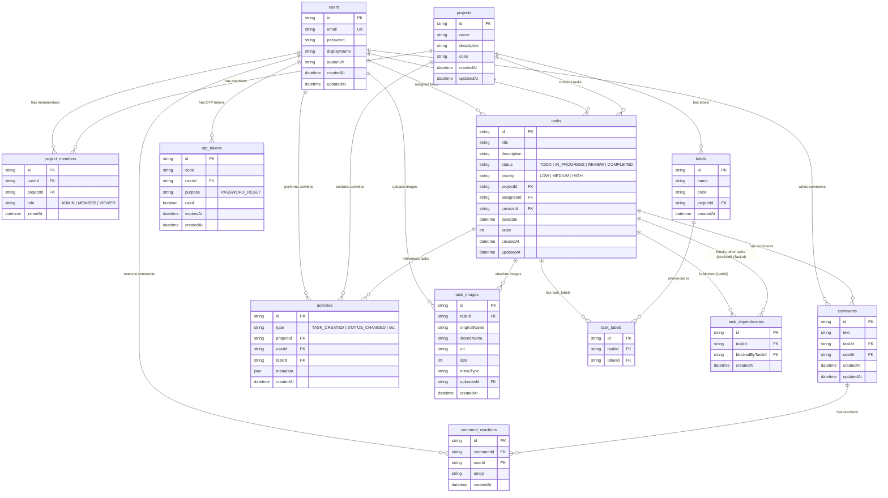

# Database Schema Document

This document describes the database schema, entity relationships, indexes, cascades, and role-based permissions designed for the Task Tracker application.

---

## Entity-Relationship Diagram (ERD)

The following Mermaid diagram shows all 12 database tables and their foreign key relationships.

---

## Tables Definition

### 1. `users`
Stores user profile credentials.

| Column | Type | Nullable | Default | Description |
| :--- | :--- | :---: | :--- | :--- |
| `id` | `String` | No | `cuid()` | Primary Key (CUID). |
| `email` | `String` | No | - | Unique login email. |
| `password` | `String` | No | - | Hashed password string. |
| `displayName`| `String` | No | - | User display name. |
| `avatarUrl` | `String` | Yes | `null` | Optional public URL pointing to a user profile avatar image. |
| `createdAt` | `DateTime`| No | `now()` | Date and time of user account registration. |
| `updatedAt` | `DateTime`| No | - | Auto-updated on record change. |

---

### 2. `projects`
Stores team projects.

| Column | Type | Nullable | Default | Description |
| :--- | :--- | :---: | :--- | :--- |
| `id` | `String` | No | `cuid()` | Primary Key (CUID). |
| `name` | `String` | No | - | Name of the project space. |
| `description`| `String` | Yes | `null` | Optional description of the project goals. |
| `color` | `String` | No | `#3b82f6` | Hex color tag assigned to the project card. |
| `createdAt` | `DateTime`| No | `now()` | Project creation date and time. |
| `updatedAt` | `DateTime`| No | - | Auto-updated on project details change. |

---

### 3. `project_members`
Junction table mapping users to projects with roles.

| Column | Type | Nullable | Default | Description |
| :--- | :--- | :---: | :--- | :--- |
| `id` | `String` | No | `cuid()` | Primary Key. |
| `userId` | `String` | No | - | Foreign Key referencing `users(id)` (OnDelete: Cascade). |
| `projectId` | `String` | No | - | Foreign Key referencing `projects(id)` (OnDelete: Cascade). |
| `role` | `Enum` | No | - | Member access level (`ADMIN`, `MEMBER`, `VIEWER`). |
| `joinedAt` | `DateTime`| No | `now()` | Timestamp when the user joined the project. |

*Unique Constraint*: Unique pair `[userId, projectId]` ensures a user cannot have duplicate memberships in the same project.

---

### 4. `tasks`
Stores individual work items.

| Column | Type | Nullable | Default | Description |
| :--- | :--- | :---: | :--- | :--- |
| `id` | `String` | No | `cuid()` | Primary Key. |
| `title` | `String` | No | - | Task title. |
| `description`| `String` | Yes | `null` | Optional description. |
| `status` | `Enum` | No | `TODO` | Task column state (`TODO`, `IN_PROGRESS`, `REVIEW`, `COMPLETED`). |
| `priority` | `Enum` | No | `MEDIUM` | Task priority (`LOW`, `MEDIUM`, `HIGH`). |
| `projectId` | `String` | No | - | Foreign Key referencing `projects(id)` (OnDelete: Cascade). |
| `assigneeId` | `String` | Yes | `null` | Foreign Key referencing `users(id)` (OnDelete: SetNull). |
| `creatorId` | `String` | No | - | Foreign Key referencing `users(id)` (OnDelete: Cascade). |
| `dueDate` | `DateTime`| Yes | `null` | Optional task deadline timestamp. |
| `order` | `Int` | No | `0` | Numerical sorting index on board status columns. |
| `createdAt` | `DateTime`| No | `now()` | Task creation timestamp. |
| `updatedAt` | `DateTime`| No | - | Auto-updated on task change. |

---

### 5. `task_images`
Tracks image attachments uploaded to tasks.

| Column | Type | Nullable | Default | Description |
| :--- | :--- | :---: | :--- | :--- |
| `id` | `String` | No | `cuid()` | Primary Key. |
| `taskId` | `String` | No | - | Foreign Key referencing `tasks(id)` (OnDelete: Cascade). |
| `originalName`| `String` | No | - | Original filename submitted by the user (e.g. `mockup.png`). |
| `storedName` | `String` | No | - | Random UUID filename stored on local disk to prevent collisions. |
| `url` | `String` | No | - | Public HTTP static file URL (constructed dynamically using `BACKEND_URL` + file subpath). |
| `size` | `Int` | No | - | File size in bytes. |
| `mimeType` | `String` | No | - | Media type of the file (e.g. `image/png`, `image/jpeg`). |
| `uploaderId` | `String` | No | - | Foreign Key referencing `users(id)` (OnDelete: Cascade). |
| `createdAt` | `DateTime`| No | `now()` | Date and time of file upload. |

---

### 6. `comments`
Stores textual comments left under tasks.

| Column | Type | Nullable | Default | Description |
| :--- | :--- | :---: | :--- | :--- |
| `id` | `String` | No | `cuid()` | Primary Key. |
| `text` | `String` | No | - | Comment text. |
| `taskId` | `String` | No | - | Foreign Key referencing `tasks(id)` (OnDelete: Cascade). |
| `userId` | `String` | No | - | Foreign Key referencing `users(id)` (OnDelete: Cascade). |
| `createdAt` | `DateTime`| No | `now()` | Comment submission timestamp. |
| `updatedAt` | `DateTime`| No | - | Timestamp of last comment update. |

---

### 7. `comment_reactions`
Stores emoji reactions toggled on comments by users.

| Column | Type | Nullable | Default | Description |
| :--- | :--- | :---: | :--- | :--- |
| `id` | `String` | No | `cuid()` | Primary Key. |
| `commentId` | `String` | No | - | Foreign Key referencing `comments(id)` (OnDelete: Cascade). |
| `userId` | `String` | No | - | Foreign Key referencing `users(id)` (OnDelete: Cascade). |
| `emoji` | `String` | No | - | The emoji character string reacted by the user. |
| `createdAt` | `DateTime`| No | `now()` | Timestamp when reaction was added. |

*Unique Constraint*: Unique triple `[commentId, userId, emoji]` enforces that a user can react with a specific emoji only once per comment.

---

### 8. `activities`
Audit log recording project actions.

| Column | Type | Nullable | Default | Description |
| :--- | :--- | :---: | :--- | :--- |
| `id` | `String` | No | `cuid()` | Primary Key. |
| `type` | `Enum` | No | - | Action type (`TASK_CREATED`, `TASK_UPDATED`, `STATUS_CHANGED`, `TASK_COMPLETED`, `COMMENT_ADDED`, `MEMBER_ADDED`, `MEMBER_REMOVED`). |
| `projectId` | `String` | No | - | Foreign Key referencing `projects(id)` (OnDelete: Cascade). |
| `userId` | `String` | No | - | Foreign Key referencing `users(id)` (OnDelete: Cascade). |
| `taskId` | `String` | Yes | `null` | Optional Foreign Key referencing `tasks(id)` (OnDelete: SetNull). |
| `metadata` | `Json` | Yes | `null` | Structured payload context (e.g., old/new statuses, edited field differences, file upload totals). |
| `createdAt` | `DateTime`| No | `now()` | Event record timestamp. |

---

### 9. `otp_tokens`
Stores short-lived 6-digit OTP codes and their verification status for operations like password resets.

| Column | Type | Nullable | Default | Description |
| :--- | :--- | :---: | :--- | :--- |
| `id` | `String` | No | `cuid()` | Primary Key. |
| `code` | `String` | No | - | The secure 6-digit verification code. |
| `userId` | `String` | No | - | Foreign Key referencing `users(id)` (OnDelete: Cascade). |
| `purpose` | `Enum` | No | `PASSWORD_RESET` | Purpose of the OTP code (enum `PASSWORD_RESET`). |
| `used` | `Boolean` | No | `false` | Status tracking if the code has been successfully verified/used. |
| `expiresAt` | `DateTime`| No | - | Time at which the code becomes invalid (15-minute lifespan). |
| `createdAt` | `DateTime`| No | `now()` | Date and time the token was generated. |

---

### 10. `labels`
Stores custom labels defined within projects.

| Column | Type | Nullable | Default | Description |
| :--- | :--- | :---: | :--- | :--- |
| `id` | `String` | No | `cuid()` | Primary Key. |
| `name` | `String` | No | - | The user-defined title of the label tag. |
| `color` | `String` | No | - | The hex color code representing the label background. |
| `projectId` | `String` | No | - | Foreign Key referencing `projects(id)` (OnDelete: Cascade) showing the project scope. |
| `createdAt` | `DateTime`| No | `now()` | Date and time of label creation. |

---

### 11. `task_labels`
Junction table mapping labels to specific tasks.

| Column | Type | Nullable | Default | Description |
| :--- | :--- | :---: | :--- | :--- |
| `id` | `String` | No | `cuid()` | Primary Key. |
| `taskId` | `String` | No | - | Foreign Key referencing `tasks(id)` (OnDelete: Cascade). |
| `labelId` | `String` | No | - | Foreign Key referencing `labels(id)` (OnDelete: Cascade). |

*Unique Constraint*: Unique pair `[taskId, labelId]` enforces that a label cannot be linked to the same task multiple times.

---

### 12. `task_dependencies`
Junction table tracking blocking relationships between tasks.

| Column | Type | Nullable | Default | Description |
| :--- | :--- | :---: | :--- | :--- |
| `id` | `String` | No | `cuid()` | Primary Key. |
| `taskId` | `String` | No | - | Foreign Key referencing `tasks(id)` (OnDelete: Cascade) indicating the blocked task. |
| `blockedByTaskId`| `String` | No | - | Foreign Key referencing `tasks(id)` (OnDelete: Cascade) indicating the blocking task. |
| `createdAt` | `DateTime`| No | `now()` | Timestamp when the dependency was set. |

*Unique Constraint*: Unique pair `[taskId, blockedByTaskId]` prevents registering duplicate dependency records.
*Circular Dependency Checks*: Enforced programmatically inside the `TasksService`. Prior to creating a dependency, the service runs a DFS traversal. If a path exists where the `blockedByTaskId` depends on `taskId`, the operation is aborted to prevent circular blockages.

---

## Relationships & Cascades

When main entities are deleted, the database automatically manages referencing records via cascades:
- **Project Deletion**: Cascade-deletes `project_members`, `tasks` (which in turn cascade-deletes related comments, images, labels, dependencies), `activities`, and project `labels`.
- **Task Deletion**: Cascade-deletes `comments`, `task_images` (files are also deleted on physical disk via `unlink` inside `TaskImagesService`), `task_labels` links, and `task_dependencies` (both directions - where it blocks or is blocked). It leaves `Activity` records intact with `taskId` set to `null` (`onDelete: SetNull`).
- **User Deletion**: Cascade-deletes project membership records, comment reactions, OTP tokens, comments, task images uploaded, and tasks created. Tasks assigned to the user are preserved with `assigneeId` set to `null` (`onDelete: SetNull`).
- **Comment Deletion**: Cascade-deletes all emoji `comment_reactions` added to that comment.
- **Label Deletion**: Cascade-deletes junction records in `task_labels` but keeps the actual tasks intact.

---

## Role-Based Access Control Model

Permissions are verified using membership records (`ProjectMember`) before executing REST controller methods or subscribing to WebSocket events:
- **`ADMIN`**: Full read-write permission over tasks, comments, and members. Only an Admin can invite new users, change member roles, delete members, update general project metadata, or delete the project.
- **`MEMBER`**: Read-write access to tasks and comments. Can upload image attachments, delete their own uploaded images, create tasks, and update tasks, but cannot alter membership, change project colors/names, or delete the project.
- **`VIEWER`**: Read-only access to tasks. Viewers can read task information, view image attachments, list comments, and write comments. They are strictly prohibited from creating tasks, updating tasks, or uploading/deleting image files.

---

## Database Indexing Strategy

To maintain sub-millisecond query response times at scale, database indexes are placed on columns frequently used in filtering and table joins:

1. **`users(email)`**: An implicit unique index. Enables high-speed user searches during authentication queries (`login`/`register`).
2. **`project_members(userId, projectId)`**: Unique compound index. Accelerates permission guards that fetch user roles in a project.
3. **`tasks(projectId)`**: Speeds up queries loading Kanban columns for a project.
4. **`task_images(taskId)`**: Custom indexing on foreign key. Since the most common query on the attachments table is "get all images associated with a task" when loading the details modal, an index on `taskId` guarantees fast lookup.
5. **`comments(taskId)`**: Relation index. Optimizes comment listing queries on task modal open.
6. **`comment_reactions(commentId)`**: Relation index. Optimizes reaction retrieval when comments are listed.
7. **`labels(projectId)`**: Relation index. Speeds up loading project labels.
8. **`task_dependencies(taskId, blockedByTaskId)`**: Compound unique index. Optimizes blocker lookups when checking dependencies during task updates.
9. **`activities(projectId)`**: Relation index. Speeds up project dashboard activity feeds (loaded on the dashboard view).
10: **`otp_tokens(userId)`**: Index on the foreign key relation. Speeds up verification lookup queries matching user ID, purpose, and active code status.

---

## Sprint 13 Board Date Filters Note

The Board Date Filters and Auto-Hide Old Tasks features (introduced in Sprint 13) are implemented entirely as frontend display-layer operations. They filter the cached tasks data locally in memory on the client browser. As a result, no new database tables, fields, indexes, or relationships were created, and the database schema remains unchanged.
