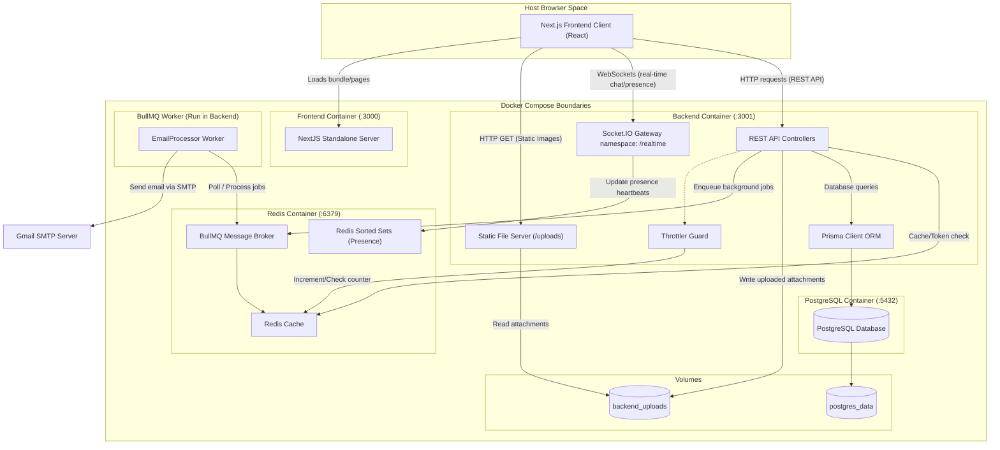

# System Architecture & Workflows

This document outlines the system architecture, component relationships, containerization boundaries, and real-time collaboration workflows of the Task Tracker application.

---

## System Components Diagram

The diagram below visualizes how the Next.js frontend client, the NestJS server application, PostgreSQL database, Redis caching/presence/job broker layer, and the asynchronous BullMQ background email worker interact inside their respective Docker container boundaries.

---

## Containerization & Docker Boundaries

The application is deployed using four main container spaces via `docker-compose.yml`:
1. **`task-tracker-frontend`**: Runs the Next.js production code compiled in standalone output mode. It is exposed to the host machine on port `3000`.
2. **`task-tracker-backend`**: Runs the NestJS server. On startup, it automatically executes database migrations via `npx prisma migrate deploy` before launching the NestJS HTTP listener on port `3001`. It shares a named volume `backend_uploads` to persist user-uploaded files across container restarts.
3. **`task-tracker-redis`**: Runs Redis 7. It serves as the caching layer for API requests, presence tracking, and the BullMQ background job broker. It is exposed internally on port `6379`.
4. **`task-tracker-db`**: Runs PostgreSQL 15. It mounts a named volume `postgres_data` to ensure all structural schemas and transactional records are permanently persisted. It is exposed on port `5432`.

---

## Authentication & Session Flow

Authentication utilizes standard JSON Web Tokens (JWT) with secure refresh token rotation (RTR) and token families:
1. **Sign In**: User submits credentials to `/api/auth/login`. On validation, the server generates a short-lived access JWT (valid for 15 minutes) and a long-lived refresh JWT (family-based, valid for 7 days).
2. **Session Rotation**: The refresh token hash is registered in the database `refresh_tokens` table. When the access token expires, the client calls `/api/auth/refresh` sending the refresh token. The server rotates both tokens, invalidating the old refresh token and issuing a new one in the same family.
3. **Token Reuse Detection**: If an old/reused refresh token is presented, the server instantly invalidates the entire token family, logging the user out across all devices to protect against theft.
4. **WebSockets Auth**: WebSockets authenticate using the same access token passed during connection handshake.

---

## New Asynchronous Workflows (Sprints 14–20)

### 1. Notification Workflow
When a collaboration action occurs (e.g. task assigned, mentioned in chat, comment added):
1. **Trigger Action**: A user completes an action in a NestJS service (e.g., `TasksService`).
2. **Database Record**: The `NotificationsService` creates a database record in the `notifications` table (read status defaults to `false`).
3. **Socket Emission**: The notification payload is broadcast immediately over WebSockets to the recipient's personal socket room (`user:<recipientId>`). The recipient's browser displays an optimistic in-app toast notification.
4. **Email Enqueuing**: The service queries the recipient's `notifyByEmail` flag. If `true`, a background email job is enqueued to the `email` queue using `EmailQueueService`.
5. **Worker Execution**: The BullMQ `EmailProcessor` running in the background worker thread polls Redis for new jobs, constructs the notification email template, and sends it asynchronously using Nodemailer via Gmail SMTP.

### 2. Chat Message Flow with Mentions
The system handles multi-channel chat and direct messaging:
1. **Send Message**: Browser A issues a `POST` request to `/api/chat/messages` with message contents and a `channelId` or `conversationId`.
2. **Persist & Mentions Parse**: The REST API writes the message to the database. It runs a regex parser against the text to locate user mentions (e.g. `@displayName`).
3. **Database Links**: For each valid mention, a record is added to the `message_mentions` table, and the **Notification Workflow** is triggered for the mentioned user.
4. **Real-time Broadcast**: The message payload is emitted via WebSockets to the active channel room (`channel:<channelId>`) or conversation room (`conversation:<conversationId>`).
5. **Badge Count Update**: For all other members, the server emits a `channel:message_received` or `conversation:message_received` event. Recipients' browsers listen to this event and invalidate React Query cache indicators (`['project-channels']` or `['conversations']`) to update unread badge counts in real time.
6. **Last Read Mark**: When a recipient clicks on the room, the frontend issues a `POST` request to mark the channel/conversation as read, which upserts a record in the `channel_last_reads` table (for channels) or updates `lastReadAt` in `conversation_participants` (for DMs).

### 3. Rate-Limited Request Flow
To prevent abuse, brute-force attacks, and API flooding:
1. **Request Hit**: An incoming HTTP request hits the NestJS server.
2. **Throttler Guard Check**: The global `ThrottlerGuard` intercepts the request.
3. **Redis Counter**: The guard generates a key matching the client's IP address and queries the `RedisCache` connection. It increments the request counter associated with that IP within the sliding time window (limit: 100 requests per minute).
4. **Proceed or Block**:
   - If the counter is under the limit, the request proceeds to the target controller method.
   - If the counter exceeds the limit, the guard blocks execution and throws a `429 Too Many Requests` HttpException. The `GlobalExceptionFilter` logs the block server-side and returns a sanitized JSON error response.
