# Database Schema Document

This document describes the database schema, entity relationships, indexes, cascades, and historical migrations designed for the Task Tracker application.

---

## Entity-Relationship Diagram (ERD)

The following Mermaid diagram shows all database tables and their foreign key relationships.

```mermaid
erDiagram
    users ||--o{ project_members : "has memberships"
    users ||--o{ tasks : "assigned tasks"
    users ||--o{ tasks : "creates tasks"
    users ||--o{ comments : "writes comments"
    users ||--o{ comment_reactions : "reacts to comments"
    users ||--o{ activities : "performs activities"
    users ||--o{ task_images : "uploads images"
    users ||--o{ otp_tokens : "has OTP tokens"
    users ||--o{ refresh_tokens : "has refresh tokens"
    users ||--o{ notifications : "receives notifications"
    users ||--o{ channels : "creates channels"
    users ||--o{ channel_members : "is member of"
    users ||--o{ channel_last_reads : "tracks read status"
    users ||--o{ conversation_participants : "participates in"
    users ||--o{ messages : "sends messages"
    users ||--o{ message_mentions : "is mentioned in"
    users ||--o{ project_files : "uploads files"

    projects ||--o{ project_members : "has members"
    projects ||--o{ tasks : "contains tasks"
    projects ||--o{ activities : "contains activities"
    projects ||--o{ labels : "has labels"
    projects ||--o{ channels : "has channels"
    projects ||--o{ project_files : "has files"

    tasks ||--o{ comments : "has comments"
    tasks ||--o{ task_images : "attaches images"
    tasks ||--o{ activities : "references tasks"
    tasks ||--o{ task_labels : "has task_labels"
    tasks ||--o{ task_dependencies : "is blocked (taskId)"
    tasks ||--o{ task_dependencies : "blocks other tasks (blockedByTaskId)"

    comments ||--o{ comment_reactions : "has reactions"

    labels ||--o{ task_labels : "referenced in"

    channels ||--o{ messages : "contains messages"
    channels ||--o{ channel_members : "has members"
    channels ||--o{ channel_last_reads : "has read marks"

    conversations ||--o{ conversation_participants : "has participants"
    conversations ||--o{ messages : "contains messages"

    messages ||--o{ message_mentions : "has mentions"
    messages ||--o{ message_attachments : "has attachments"

    users {
        string id PK
        string email UK
        string password
        string displayName
        string avatarUrl
        boolean notifyByEmail
        datetime createdAt
        datetime updatedAt
    }

    projects {
        string id PK
        string name
        string description
        string color
        datetime createdAt
        datetime updatedAt
    }

    project_members {
        string id PK
        string userId FK
        string projectId FK
        string role "ADMIN | MEMBER | MANAGER"
        datetime joinedAt
        datetime lastReadAt
    }

    tasks {
        string id PK
        string title
        string description
        string status "TODO | IN_PROGRESS | REVIEW | COMPLETED"
        string priority "LOW | MEDIUM | HIGH"
        string projectId FK
        string assigneeId FK
        string creatorId FK
        datetime dueDate
        int order
        datetime createdAt
        datetime updatedAt
    }

    task_images {
        string id PK
        string taskId FK
        string originalName
        string storedName
        string url
        int size
        string mimeType
        string uploaderId FK
        datetime createdAt
    }

    comments {
        string id PK
        string text
        string taskId FK
        string userId FK
        datetime createdAt
        datetime updatedAt
    }

    comment_reactions {
        string id PK
        string commentId FK
        string userId FK
        string emoji
        datetime createdAt
    }

    activities {
        string id PK
        string type "TASK_CREATED | STATUS_CHANGED | etc."
        string projectId FK
        string userId FK
        string taskId FK
        json metadata
        datetime createdAt
    }

    otp_tokens {
        string id PK
        string code
        string userId FK
        string purpose "PASSWORD_RESET"
        boolean used
        datetime expiresAt
        datetime createdAt
    }

    labels {
        string id PK
        string name
        string color
        string projectId FK
        datetime createdAt
    }

    task_labels {
        string id PK
        string taskId FK
        string labelId FK
    }

    task_dependencies {
        string id PK
        string taskId FK
        string blockedByTaskId FK
        datetime createdAt
    }

    refresh_tokens {
        string id PK
        string tokenHash UK
        string userId FK
        string family
        boolean revoked
        datetime createdAt
        datetime expiresAt
    }

    notifications {
        string id PK
        string recipientId FK
        string type "TASK_ASSIGNED | TASK_UPDATED | etc."
        boolean read
        string title
        string body
        string link
        json metadata
        datetime createdAt
    }

    channels {
        string id PK
        string projectId FK
        string name
        string description
        boolean isPrivate
        boolean isGeneral
        boolean isArchived
        string creatorId FK
        datetime createdAt
    }

    channel_members {
        string id PK
        string channelId FK
        string userId FK
        datetime joinedAt
    }

    conversations {
        string id PK
        datetime createdAt
    }

    conversation_participants {
        string id PK
        string conversationId FK
        string userId FK
        datetime joinedAt
        datetime lastReadAt
    }

    messages {
        string id PK
        string content
        string senderId FK
        string channelId FK
        string conversationId FK
        datetime createdAt
        datetime updatedAt
    }

    message_mentions {
        string id PK
        string messageId FK
        string userId FK
    }

    message_attachments {
        string id PK
        string messageId FK
        string originalName
        string storedName
        string url
        int size
        string mimeType
        datetime createdAt
    }

    project_files {
        string id PK
        string projectId FK
        string originalName
        string storedName
        string url
        int size
        string mimeType
        string uploaderId FK
        datetime createdAt
    }

    channel_last_reads {
        string id PK
        string channelId FK
        string userId FK
        datetime lastReadAt
    }
```

---

## Tables Definition

### 1. `users`
Stores user profile credentials.

| Column | Type | Nullable | Default | Description |
| :--- | :--- | :---: | :--- | :--- |
| `id` | `String` | No | `cuid()` | Primary Key (CUID). |
| `email` | `String` | No | - | Unique login email. |
| `password` | `String` | No | - | Hashed password string. |
| `displayName`| `String` | No | - | User display name. |
| `avatarUrl` | `String` | Yes | `null` | Optional public URL pointing to a user profile avatar image. |
| `notifyByEmail` | `Boolean` | No | `true` | User preference to toggle email notifications. |
| `createdAt` | `DateTime`| No | `now()` | Date and time of user account registration. |
| `updatedAt` | `DateTime`| No | - | Auto-updated on record change. |

---

### 2. `projects`
Stores team projects.

| Column | Type | Nullable | Default | Description |
| :--- | :--- | :---: | :--- | :--- |
| `id` | `String` | No | `cuid()` | Primary Key (CUID). |
| `name` | `String` | No | - | Name of the project space. |
| `description`| `String` | Yes | `null` | Optional description of the project goals. |
| `color` | `String` | No | `#3b82f6` | Hex color tag assigned to the project card. |
| `createdAt` | `DateTime`| No | `now()` | Project creation date and time. |
| `updatedAt` | `DateTime`| No | - | Auto-updated on project details change. |

---

### 3. `project_members`
Junction table mapping users to projects with roles.

| Column | Type | Nullable | Default | Description |
| :--- | :--- | :---: | :--- | :--- |
| `id` | `String` | No | `cuid()` | Primary Key. |
| `userId` | `String` | No | - | Foreign Key referencing `users(id)` (OnDelete: Cascade). |
| `projectId` | `String` | No | - | Foreign Key referencing `projects(id)` (OnDelete: Cascade). |
| `role` | `Enum` | No | - | Member access level (`ADMIN`, `MEMBER`, `MANAGER`). |
| `joinedAt` | `DateTime`| No | `now()` | Timestamp when the user joined the project. |
| `lastReadAt` | `DateTime`| No | `now()` | Deprecated in favor of channel-specific last read. |

*Unique Constraint*: Unique pair `[userId, projectId]` ensures a user cannot have duplicate memberships in the same project.

---

### 4. `tasks`
Stores individual work items.

| Column | Type | Nullable | Default | Description |
| :--- | :--- | :---: | :--- | :--- |
| `id` | `String` | No | `cuid()` | Primary Key. |
| `title` | `String` | No | - | Task title. |
| `description`| `String` | Yes | `null` | Optional description. |
| `status` | `Enum` | No | `TODO` | Task column state (`TODO`, `IN_PROGRESS`, `REVIEW`, `COMPLETED`). |
| `priority` | `Enum` | No | `MEDIUM` | Task priority (`LOW`, `MEDIUM`, `HIGH`). |
| `projectId` | `String` | No | - | Foreign Key referencing `projects(id)` (OnDelete: Cascade). |
| `assigneeId` | `String` | Yes | `null` | Foreign Key referencing `users(id)` (OnDelete: SetNull). |
| `creatorId` | `String` | No | - | Foreign Key referencing `users(id)` (OnDelete: Cascade). |
| `dueDate` | `DateTime`| Yes | `null` | Optional task deadline timestamp. |
| `order` | `Int` | No | `0` | Numerical sorting index on board status columns. |
| `createdAt` | `DateTime`| No | `now()` | Task creation timestamp. |
| `updatedAt` | `DateTime`| No | - | Auto-updated on task change. |

---

### 5. `task_images`
Tracks image attachments uploaded to tasks.

| Column | Type | Nullable | Default | Description |
| :--- | :--- | :---: | :--- | :--- |
| `id` | `String` | No | `cuid()` | Primary Key. |
| `taskId` | `String` | No | - | Foreign Key referencing `tasks(id)` (OnDelete: Cascade). |
| `originalName`| `String` | No | - | Original filename submitted by the user. |
| `storedName` | `String` | No | - | Random UUID filename stored on local disk. |
| `url` | `String` | No | - | Public HTTP static file URL. |
| `size` | `Int` | No | - | File size in bytes. |
| `mimeType` | `String` | No | - | Media type of the file. |
| `uploaderId` | `String` | No | - | Foreign Key referencing `users(id)` (OnDelete: Cascade). |
| `createdAt` | `DateTime`| No | `now()` | Date and time of file upload. |

---

### 6. `comments`
Stores textual comments left under tasks.

| Column | Type | Nullable | Default | Description |
| :--- | :--- | :---: | :--- | :--- |
| `id` | `String` | No | `cuid()` | Primary Key. |
| `text` | `String` | No | - | Comment text. |
| `taskId` | `String` | No | - | Foreign Key referencing `tasks(id)` (OnDelete: Cascade). |
| `userId` | `String` | No | - | Foreign Key referencing `users(id)` (OnDelete: Cascade). |
| `createdAt` | `DateTime`| No | `now()` | Comment submission timestamp. |
| `updatedAt` | `DateTime`| No | - | Timestamp of last comment update. |

---

### 7. `comment_reactions`
Stores emoji reactions toggled on comments by users.

| Column | Type | Nullable | Default | Description |
| :--- | :--- | :---: | :--- | :--- |
| `id` | `String` | No | `cuid()` | Primary Key. |
| `commentId` | `String` | No | - | Foreign Key referencing `comments(id)` (OnDelete: Cascade). |
| `userId` | `String` | No | - | Foreign Key referencing `users(id)` (OnDelete: Cascade). |
| `emoji` | `String` | No | - | The emoji character string reacted by the user. |
| `createdAt` | `DateTime`| No | `now()` | Timestamp when reaction was added. |

*Unique Constraint*: Unique triple `[commentId, userId, emoji]` enforces that a user can react with a specific emoji only once per comment.

---

### 8. `activities`
Audit log recording project actions.

| Column | Type | Nullable | Default | Description |
| :--- | :--- | :---: | :--- | :--- |
| `id` | `String` | No | `cuid()` | Primary Key. |
| `type` | `Enum` | No | - | Action type (`TASK_CREATED`, `STATUS_CHANGED`, `TASK_UPDATED`, `TASK_COMPLETED`, `COMMENT_ADDED`, `MEMBER_ADDED`, `MEMBER_REMOVED`, `FILE_UPLOADED`, `FILE_DELETED`). |
| `projectId` | `String` | No | - | Foreign Key referencing `projects(id)` (OnDelete: Cascade). |
| `userId` | `String` | No | - | Foreign Key referencing `users(id)` (OnDelete: Cascade). |
| `taskId` | `String` | Yes | `null` | Optional Foreign Key referencing `tasks(id)` (OnDelete: SetNull). |
| `metadata` | `Json` | Yes | `null` | Structured payload context. |
| `createdAt` | `DateTime`| No | `now()` | Event record timestamp. |

---

### 9. `otp_tokens`
Stores short-lived 6-digit OTP codes and their verification status for operations like password resets.

| Column | Type | Nullable | Default | Description |
| :--- | :--- | :---: | :--- | :--- |
| `id` | `String` | No | `cuid()` | Primary Key. |
| `code` | `String` | No | - | The secure 6-digit verification code. |
| `userId` | `String` | No | - | Foreign Key referencing `users(id)` (OnDelete: Cascade). |
| `purpose` | `Enum` | No | `PASSWORD_RESET` | Purpose of the OTP code (enum `PASSWORD_RESET`). |
| `used` | `Boolean` | No | `false` | Status tracking if the code has been successfully verified/used. |
| `expiresAt` | `DateTime`| No | - | Time at which the code becomes invalid. |
| `createdAt` | `DateTime`| No | `now()` | Date and time the token was generated. |

---

### 10. `labels`
Stores custom labels defined within projects.

| Column | Type | Nullable | Default | Description |
| :--- | :--- | :---: | :--- | :--- |
| `id` | `String` | No | `cuid()` | Primary Key. |
| `name` | `String` | No | - | The user-defined title of the label tag. |
| `color` | `String` | No | - | The hex color code representing the label background. |
| `projectId` | `String` | No | - | Foreign Key referencing `projects(id)` (OnDelete: Cascade). |
| `createdAt` | `DateTime`| No | `now()` | Date and time of label creation. |

---

### 11. `task_labels`
Junction table mapping labels to specific tasks.

| Column | Type | Nullable | Default | Description |
| :--- | :--- | :---: | :--- | :--- |
| `id` | `String` | No | `cuid()` | Primary Key. |
| `taskId` | `String` | No | - | Foreign Key referencing `tasks(id)` (OnDelete: Cascade). |
| `labelId` | `String` | No | - | Foreign Key referencing `labels(id)` (OnDelete: Cascade). |

*Unique Constraint*: Unique pair `[taskId, labelId]` enforces that a label cannot be linked to the same task multiple times.

---

### 12. `task_dependencies`
Junction table tracking blocking relationships between tasks.

| Column | Type | Nullable | Default | Description |
| :--- | :--- | :---: | :--- | :--- |
| `id` | `String` | No | `cuid()` | Primary Key. |
| `taskId` | `String` | No | - | Foreign Key referencing `tasks(id)` (OnDelete: Cascade) indicating the blocked task. |
| `blockedByTaskId`| `String` | No | - | Foreign Key referencing `tasks(id)` (OnDelete: Cascade) indicating the blocking task. |
| `createdAt` | `DateTime`| No | `now()` | Timestamp when the dependency was set. |

---

### 13. `refresh_tokens`
Stores JWT refresh tokens for session management and rotation.

| Column | Type | Nullable | Default | Description |
| :--- | :--- | :---: | :--- | :--- |
| `id` | `String` | No | `cuid()` | Primary Key. |
| `tokenHash` | `String` | No | - | Unique hashed token payload string. |
| `userId` | `String` | No | - | Foreign Key referencing `users(id)` (OnDelete: Cascade). |
| `family` | `String` | No | - | Token family identifier (for rotation/revocation detection). |
| `revoked` | `Boolean` | No | `false` | Revocation status flag. |
| `createdAt` | `DateTime`| No | `now()` | Token issuance timestamp. |
| `expiresAt` | `DateTime`| No | - | Token expiration lifespan. |

---

### 14. `notifications`
Stores in-app notifications generated for users.

| Column | Type | Nullable | Default | Description |
| :--- | :--- | :---: | :--- | :--- |
| `id` | `String` | No | `cuid()` | Primary Key. |
| `recipientId` | `String` | No | - | Foreign Key referencing `users(id)` (OnDelete: Cascade). |
| `type` | `Enum` | No | - | Notification event type (`TASK_ASSIGNED`, `TASK_UPDATED`, `MENTIONED_IN_COMMENT`, `MENTIONED_IN_CHAT`, `STATUS_CHANGED_ON_ASSIGNED_TASK`). |
| `read` | `Boolean` | No | `false` | Visual read status. |
| `title` | `String` | No | - | Notification title. |
| `body` | `String` | No | - | Notification descriptive text body. |
| `link` | `String` | Yes | `null` | Optional router redirection link. |
| `metadata` | `Json` | Yes | `null` | Optional payload metadata. |
| `createdAt` | `DateTime`| No | `now()` | Creation timestamp. |

---

### 15. `channels`
Stores project-specific communication channels.

| Column | Type | Nullable | Default | Description |
| :--- | :--- | :---: | :--- | :--- |
| `id` | `String` | No | `cuid()` | Primary Key. |
| `projectId` | `String` | No | - | Foreign Key referencing `projects(id)` (OnDelete: Cascade). |
| `name` | `String` | No | - | Unique-ish channel slug name. |
| `description`| `String` | Yes | `null` | Optional descriptive label. |
| `isPrivate` | `Boolean` | No | `false` | Visibility lock flag (invitation required if true). |
| `isGeneral` | `Boolean` | No | `false` | Flag defining default workspace general channel (cannot be archived/deleted). |
| `isArchived` | `Boolean` | No | `false` | Archive status flag. |
| `creatorId` | `String` | Yes | `null` | Foreign Key referencing `users(id)` (OnDelete: SetNull). |
| `createdAt` | `DateTime`| No | `now()` | Channel creation timestamp. |

---

### 16. `channel_members`
Junction table tracking membership for private/restricted channels.

| Column | Type | Nullable | Default | Description |
| :--- | :--- | :---: | :--- | :--- |
| `id` | `String` | No | `cuid()` | Primary Key. |
| `channelId` | `String` | No | - | Foreign Key referencing `channels(id)` (OnDelete: Cascade). |
| `userId` | `String` | No | - | Foreign Key referencing `users(id)` (OnDelete: Cascade). |
| `joinedAt` | `DateTime`| No | `now()` | Membership timestamp. |

---

### 17. `conversations`
Main direct messaging room metadata (has no title; participants define conversation naming).

| Column | Type | Nullable | Default | Description |
| :--- | :--- | :---: | :--- | :--- |
| `id` | `String` | No | `cuid()` | Primary Key. |
| `createdAt` | `DateTime`| No | `now()` | Room instantiation timestamp. |

---

### 18. `conversation_participants`
Junction table mapping users into DM conversations.

| Column | Type | Nullable | Default | Description |
| :--- | :--- | :---: | :--- | :--- |
| `id` | `String` | No | `cuid()` | Primary Key. |
| `conversationId`| `String` | No | - | Foreign Key referencing `conversations(id)` (OnDelete: Cascade). |
| `userId` | `String` | No | - | Foreign Key referencing `users(id)` (OnDelete: Cascade). |
| `joinedAt` | `DateTime`| No | `now()` | Participant join timestamp. |
| `lastReadAt` | `DateTime`| No | `now()` | Last read timestamp for DM indicators. |

---

### 19. `messages`
Stores text chat messages posted in channels or DM conversations.

| Column | Type | Nullable | Default | Description |
| :--- | :--- | :---: | :--- | :--- |
| `id` | `String` | No | `cuid()` | Primary Key. |
| `content` | `String` | No | - | Text message content (Markdown supported). |
| `senderId` | `String` | No | - | Foreign Key referencing `users(id)` (OnDelete: Cascade). |
| `channelId` | `String` | Yes | `null` | Foreign Key referencing `channels(id)` (OnDelete: Cascade). |
| `conversationId`| `String` | Yes | `null` | Foreign Key referencing `conversations(id)` (OnDelete: Cascade). |
| `createdAt` | `DateTime`| No | `now()` | message post timestamp. |
| `updatedAt` | `DateTime`| No | - | Timestamp of edit modifications. |

---

### 20. `message_mentions`
Tracks user mentions inside chat messages (e.g. `@username`).

| Column | Type | Nullable | Default | Description |
| :--- | :--- | :---: | :--- | :--- |
| `id` | `String` | No | `cuid()` | Primary Key. |
| `messageId` | `String` | No | - | Foreign Key referencing `messages(id)` (OnDelete: Cascade). |
| `userId` | `String` | No | - | Foreign Key referencing `users(id)` (OnDelete: Cascade). |

---

### 21. `message_attachments`
Tracks image files uploaded as inline chat attachments.

| Column | Type | Nullable | Default | Description |
| :--- | :--- | :---: | :--- | :--- |
| `id` | `String` | No | `cuid()` | Primary Key. |
| `messageId` | `String` | No | - | Foreign Key referencing `messages(id)` (OnDelete: Cascade). |
| `originalName`| `String` | No | - | Submitted filename. |
| `storedName` | `String` | No | - | Encrypted filename on local disk. |
| `url` | `String` | No | - | Static route URL path. |
| `size` | `Int` | No | - | File size in bytes. |
| `mimeType` | `String` | No | - | Image mime type. |
| `createdAt` | `DateTime`| No | `now()` | Upload timestamp. |

---

### 22. `project_files`
Stores file attachments linked directly to projects.

| Column | Type | Nullable | Default | Description |
| :--- | :--- | :---: | :--- | :--- |
| `id` | `String` | No | `cuid()` | Primary Key. |
| `projectId` | `String` | No | - | Foreign Key referencing `projects(id)` (OnDelete: Cascade). |
| `originalName`| `String` | No | - | Submitted filename. |
| `storedName` | `String` | No | - | Encrypted disk filename. |
| `url` | `String` | No | - | Static download URL path. |
| `size` | `Int` | No | - | File size. |
| `mimeType` | `String` | No | - | Mime type of file. |
| `uploaderId` | `String` | No | - | Foreign Key referencing `users(id)` (OnDelete: Cascade). |
| `createdAt` | `DateTime`| No | `now()` | Upload timestamp. |

---

### 23. `channel_last_reads` *(Manual Change Addition)*
Junction table tracking user-specific read marks per channel to calculate unread counters.

| Column | Type | Nullable | Default | Description |
| :--- | :--- | :---: | :--- | :--- |
| `id` | `String` | No | `cuid()` | Primary Key. |
| `channelId` | `String` | No | - | Foreign Key referencing `channels(id)` (OnDelete: Cascade). |
| `userId` | `String` | No | - | Foreign Key referencing `users(id)` (OnDelete: Cascade). |
| `lastReadAt` | `DateTime`| No | `now()` | Timestamp of last read action. |

---

## Relationships & Cascades

When main entities are deleted, the database automatically manages referencing records via cascades:
- **Project Deletion**: Cascade-deletes `project_members`, `tasks` (which in turn cascade-deletes related comments, images, labels, dependencies), `activities`, project `labels`, `channels` (which cascade-deletes messages, members, and last read lists), and `project_files`.
- **Task Deletion**: Cascade-deletes `comments`, `task_images` (files are also deleted on physical disk via `unlink`), `task_labels` links, and `task_dependencies`.
- **User Deletion**: Cascade-deletes project membership records, comment reactions, OTP tokens, comments, task images uploaded, tasks created, refresh tokens, notifications, message mentions, channel memberships, and direct messaging participants. Tasks assigned to the user are preserved with `assigneeId` set to `null` (`onDelete: SetNull`).
- **Channel Deletion**: Cascade-deletes all `messages` (and their mentions/attachments), `channel_members` links, and `channel_last_reads` records.
- **Conversation Deletion**: Cascade-deletes all `messages` (mentions/attachments) and `conversation_participants`.
- **Message Deletion**: Cascade-deletes message mentions and inline attachments.

---

## Role-Based Access Control Model

Permissions are verified using membership records (`ProjectMember`) before executing REST controller methods or subscribing to WebSocket events:
- **`ADMIN`**: Full read-write permission over tasks, comments, and members. Only an Admin can invite new users, change member roles, delete members, update general project metadata, or delete the project.
- **`MANAGER`**: Read-write access to tasks and comments. Managers can create and update tasks, manage labels, and set task dependencies, but cannot alter membership, change project colors/names, or delete the project.
- **`MEMBER`**: Read-write access to tasks and comments. Can create tasks and update tasks, upload task images, and delete their own uploaded images.
- **`VIEWER`**: Read-only access. Viewers can view tasks and attachments, list comments, and write comments. They are strictly prohibited from creating or updating tasks, managing labels, or uploading files.

---

## Database Indexing Strategy

To maintain sub-millisecond query response times at scale, database indexes are placed on columns frequently used in filtering and table joins:

1. **`users(email)`**: An implicit unique index. Enables high-speed user searches during authentication queries (`login`/`register`).
2. **`users(displayName)`**: Index to speed up mentions auto-completion search.
3. **`projects(name)`**: Index to speed up project lookups.
4. **`project_members(userId, projectId)`**: Unique compound index. Accelerates permission guards that fetch user roles in a project.
5. **`tasks(projectId)`**: Speeds up queries loading Kanban columns for a project.
6. **`tasks(title)`**: Index to optimize unified task title searches.
7. **`comments(text)`**: Index to speed up comment-based unified search queries.
8. **`comment_reactions(commentId)`**: Relation index. Optimizes reaction retrieval when comments are listed.
9. **`labels(projectId)`**: Relation index. Speeds up loading project labels.
10. **`task_dependencies(taskId, blockedByTaskId)`**: Compound unique index. Optimizes blocker lookups when checking dependencies during task updates.
11. **`activities(projectId)`**: Relation index. Speeds up project dashboard activity feeds (loaded on the dashboard view).
12. **`otp_tokens(userId)`**: Index on the foreign key relation. Speeds up verification lookup queries matching user ID, purpose, and active code status.
13. **`refresh_tokens(tokenHash)`**: Unique index for session authentication lookups.
14. **`channel_members(channelId, userId)`**: Compound unique index for membership access validations.
15. **`conversation_participants(conversationId, userId)`**: Compound unique index for checking participant room permissions.
16. **`channel_last_reads(channelId, userId)`**: Compound unique index for calculating user-specific channel unread counters.
17. **`messages(channelId)` & `messages(conversationId)`**: Speeds up loading chat history for channels and DMs.

---

## Database Migration History Notes

### 1. Project Role Enum Migration
In the original database schema, the `ProjectRole` enum had values `[ADMIN, MEMBER, VIEWER]`. To match changing enterprise access models:
- The `ProjectRole` enum was updated to include the `MANAGER` role.
- Security guards and controller validation checks were updated to handle `MANAGER` level actions (e.g. allowing managers to edit tasks, manage labels, and configure dependencies).

### 2. Channel Model Migration
Originally, each project had exactly one implicit general chat workspace. To support multi-channel collaboration:
- The system migrated to a multi-channel structure with a dedicated `Channel` table (linked one-to-many to `Project`).
- Added properties `isPrivate` (restricted access), `isGeneral` (default channel mapping), and `isArchived` (archived flag).
- Standardized junction schema (`channel_members` and `channel_last_reads`) to allow distinct access controls and unread message calculations per channel space.
